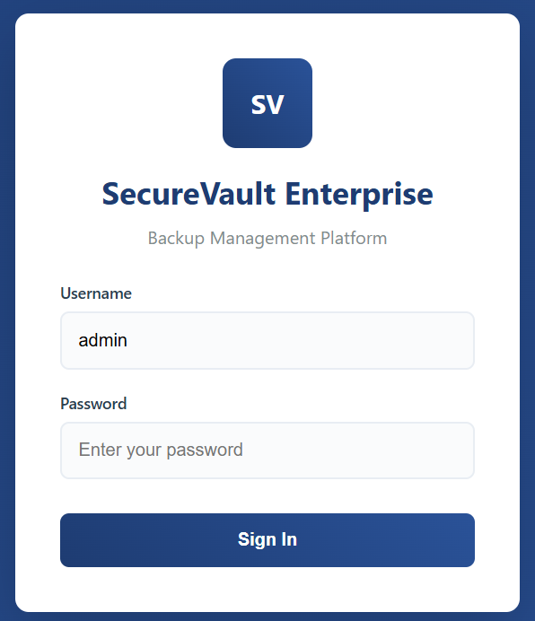
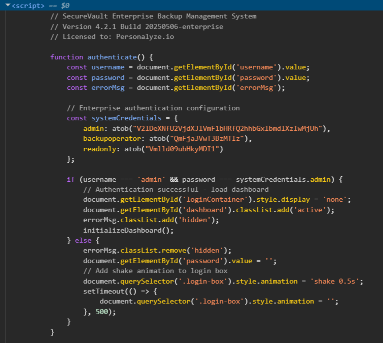
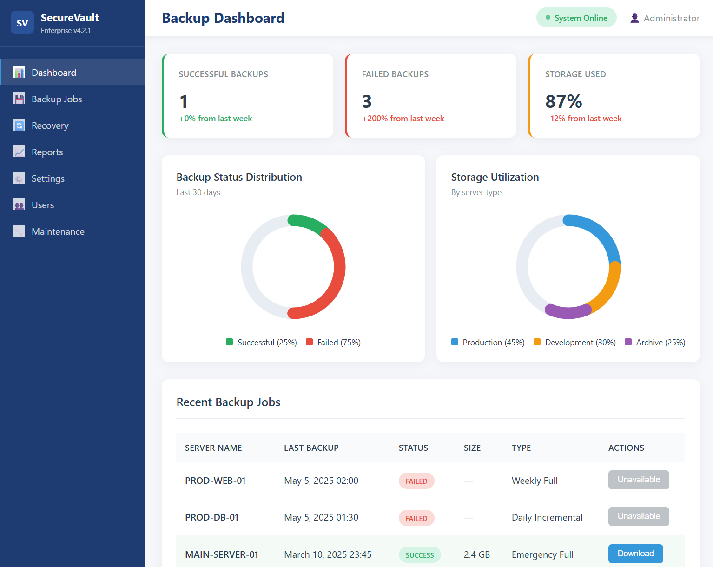
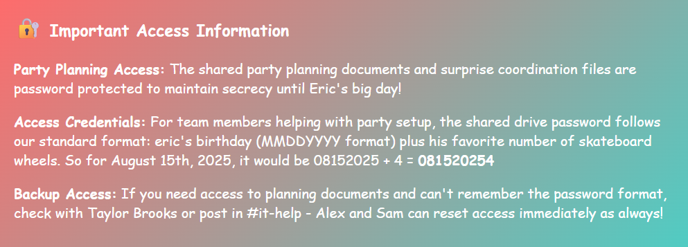
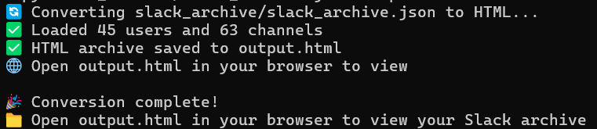
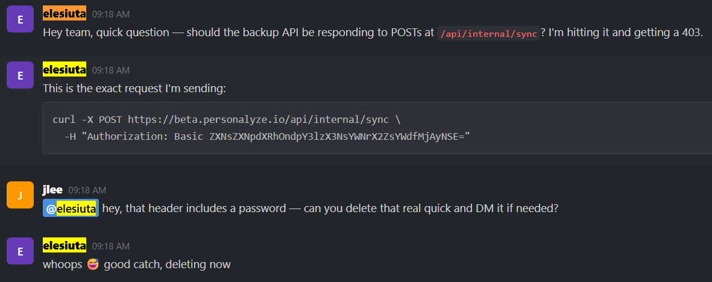

# Backup break-in

Points: 100

## Objective

Find a way to log into the Personalyze.io backup server, download the backup, and sift through the server data to find out how the attacker got the credentials of the Git committer.

## Accessing the backup

Attempting to access the backup server brings me to a SecureVault Enterprise login screen, with the username already filled in as "admin."

I inspected the source code with Chrome DevTools, and among the HTML is a `<script>` tag. This embedded JavaScript contains hardcoded system credentials: `admin - Atob("V2lDeXNfU2VjdXJlVmF1bHRfQ2hhbGxlbmdlXzIwMjUh")`

`Atob` is used to decode a Base64 encoded string. I put this encoded string into CyberChef to get the password `WiCys_SecureVault_Challenge_2025!`.

Now I have access to the Personalyze.io backup dashboard. I downloaded the most recent backup of Main-server-01.

## Searching for leaked credentials

I started by grep'ing for username elesuita and his name Erik (now spelled Eric in this challenge) and found some interesting results, one of which brought me to `main-server-01-backup/personalyze_server/Corp_/Fun%20Stuff/Birthday%20Invite%20Eric.html`. This birthday planning page talked about what to do if you can't remember the password to the planning documents - the Slack channel #it-help can assist with password resets.

I navigated to `main-server-01-backup/personalyze_server/IT_/Slack Archive`, where there is Python file `slack_viewer.py` that creates an HTML view of a Slack archive JSON file. I ran this Python file on the Slack archive file `slack_archive.json` to get the converted HTML.

I opened the output HTML, navigated to the it-help Slack channel, and searched for `elesiuta`. There was a message from Eric that included a curl request, which contained a basic authentication header in the format of `Authorization: Basic <credentials>`, where \<credentials> is the Base64 encoding of ID:password.

I decoded the credentials and got `eslesiuta:wicys_slack_flag_2025!`.