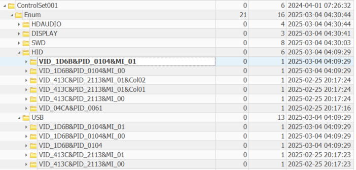

# Semi-final boss

Points: 300

## Objective

The investigation led us to a host owned by a new Personalyze.io employee, John Miller. The machine seems to contain no trace of any activity (including malware, remote access software, and C2 traffic); the only artifact that has not been searched is the Windows registry hive. Find at least one suspicious registry key.

## Keys

This is the HKEY_LOCAL_MACHINE (HKLM) hive, which stores configuration data for the operating system including settings for services, drivers, and hardware profiles.

I used both Registry Explorer and RegRipper for analysis. Registry Explorer was great for navigating the registry via GUI and searching for specific keys, while RegRipper came with a lot of useful plugins to extract certain sets of information.

I tried a variety of approaches in my investigation, including focusing on more recently modified keys, checking ShimCache, mounted devices, BAM (Background Activity Moderator), ControlSet001 - particularly Services (services and device drivers), Enum (hardware devices), and Control (global OS settings) - and more.

Throughout my search, I found a number of potentially suspicious indicators or weak security configurations, including:

- Remote access and RDP lockout policy: no account lockout set to occur, which allows for brute forcing
- Symlinks: local-to-remote evaluation is set to allow, which allows symlinks to a remote Universal Naming Convention (UNC) path (such as `\\attacker\share\malware.exe`); as such, this setting should typically be disabled
- BAM: in the BAM logs, we can see that John Miller launched multiple executables from Temp file paths within a short time frame, which can be a sign of malicious software being dropped
- Mounted devices: one USB has a discrepancy between "Last Removal" date and "First Inserted" date, where Last Removal occurs before First Inserted - this could be due to time sync issues or some sort of tampering
- Mounted devices: the C: Drive ID has non-ASCII characters `DMIO:ID:ñ>º›µQgOŒÒ¾/˜’©y`, which could indicate a malformed disk, a fake device created by malware, or some obfuscation was used

However, none of the registry keys I had identified above were the correct answer. I was at a loss as to how to continue my investigation, so I finally decided to purchase a hint (costing 90 of the points I had earned). The hint stated that I should be looking at IP KVMs (keyboards, video, mouse) under the enum section of the registry. This allowed me to quickly identify the correct key, which is one of the most recently modified/plugged-in HID (Human Interface Device) registry keys.

I had previously identified this device on the physical USB layer and submitted it as an attempt, but this challenge was specifically looking for the logical interface layer for the correct answer.
