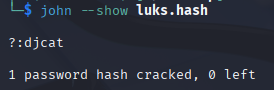

# Final Boss

Points: 500

## Objective

The insider threat has connected a TinyPilot a remotely control their corporate laptop. An SD card was found inside the laptop, and our job is to analyze the SD card image and find an indicator of compromise (IOC) that points to the threat actor (e.g., IP address).

## Brute force

TinyPilot is an open-source KVM over IP device that allows remote access of computers via a web browser. It primarily runs over Raspberry Pi hardware.

I loaded the disk image file into a Kali Linux VM. As the file is a 7z file, I ran the command `7z x sdcard.img.7z` to unzip it. Attempting to mount the extracted disk image resulted in a boot partition and an encrypted partition. The boot partition contains the kernel, initial RAM file system (initramfs) and other bootloader files. The encrypted partition requires a passphrase to be unlock it and access the contents.

I ran a command on the encrypted partition to see what type of encryption is used, and confirmed that it is using LUKS1. LUKS1, compared to LUKS2, is more susceptible to brute-force attacks. Before going down the brute force path, I checked the boot partition to see if it might contain a key file or some other clues about the key/passphrase. I found a boot parameter file (cmdline.txt) which confirms that a LUKS-encrypted device should be unlocked during boot, and makes no references a .key file. 


Finding no other clues to the passphrase, I figured it was time to try brute forcing. I ran a series of commands to export the LUKS header, generate a hash of the header, and run John the Ripper password cracking tool on the hash using a popular leaked password list `rockyou.txt`.

```bash
sudo dd if=/dev/loop0p2 of=luks_header.img bs=512 count=4096
luks2john luks_header.img > luks.hash
john luks.hash --wordlist=/usr/share/wordlists/rockyou.txt
```

The password was cracked successfully: `djcat`.



I entered this passphrase into the encrypted partition and got access.

## Suspicious connections

So here we are looking for an outbound connection where data was being sent to. I first tried to grep for IPs but saw that there were way too many results. Instead, I took a more manual approach of digging through folders, starting with ones that are more likely to provide some clues or contain the data exfiltration job:

- `/var/log/` - checked for files like syslog, messages, auth.log
- `/etc/hosts`, `/etc/resolv.conf` - might show DNS or hosts info
- `/etc/cron.*`, `/var/spool/cron/`	- Scheduled jobs that may exfil data
- `/etc/systemd/system/`, `/lib/systemd/system/` - look for malicious .service files

And it was under `/etc/systemd/system/` where I came across a file named `tunnel.service`:


This looked like some kind of encrypted payload. With some further research, I confirmed that this file was piping a Base64-encoded and AES-encrypted payload directly to bash, meaning that the payload is executed live in memory to leave minimal trace on the disk. A password is used for the decryption that consists of the concatenation of environment variables `$HOSTNAME` and `$MACHTYPE`. So to decrypt the payload, I need to identify the hostname and machine type (CPU architecture) of this device.

I was able to find hostname under `/etc/hostname` - the hostname is `tinypilot`.

The machine type was a bit more tricky. At first, I thought I could plug in the most likely architecture types for Raspberry Pi - armv7l, armv6l, etc., but these all resulted in a bad decrypt error.


I then learned that the standard Unix format for the $MACHTYPE environment variable is `cpu-company-system`, such as `x86_64-pc-linux-gnu`. So, I grep'ed for "MACHTYPE" within the partition, and this led me to the `/usr/bin/bashbug` file which defined MACHTYPE as `arm-unknown-linux-gnueabihf`.


I ran the decrypt command again and successfully found the IOC: `user@232.122.57.92`.


