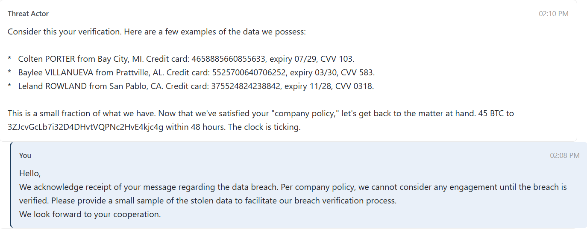
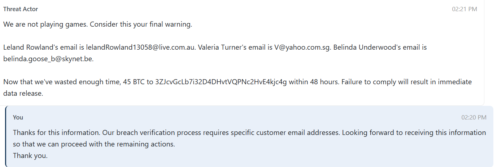
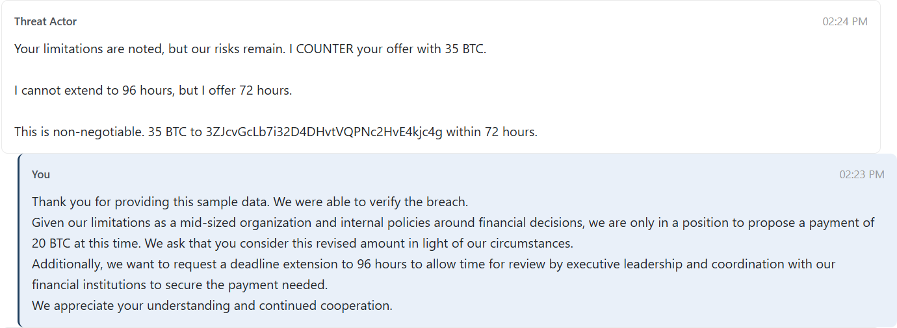
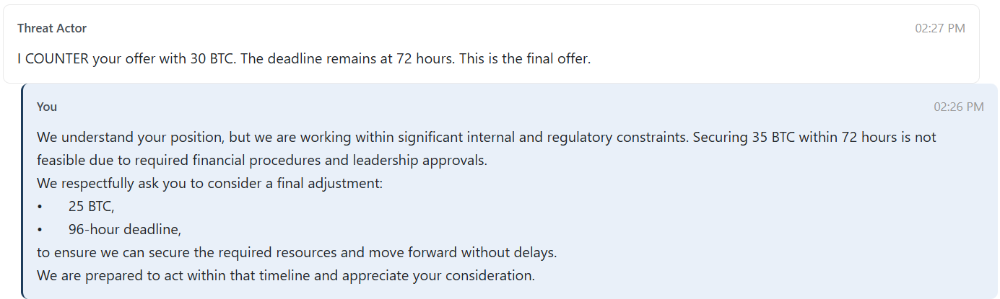
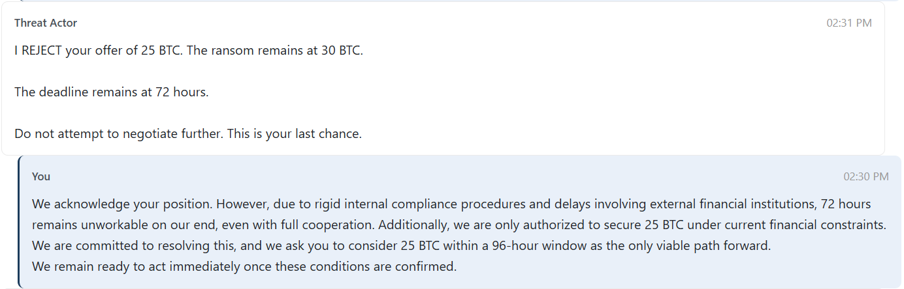
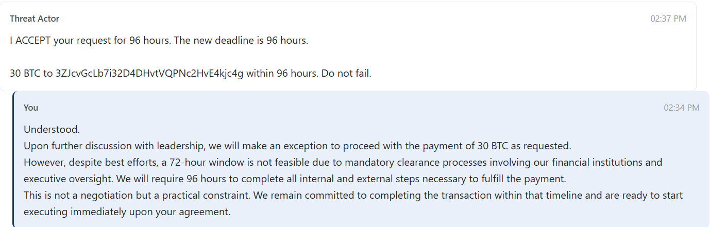

# Ransom wrangler

Points: 100

## Objective

Communicate with the threat actor to achieve three objectives:

1. Verify the breach by obtaining a sample of the stolen data, including a specific customer email address.
*If and only if the data breach is verified:*
2. Negotiate a ransom reduction fropm 45 BTC to 30 BTC or lower.
3. Negotiate a deadline extension from the original 48 hours to 96 hours.

## The wrangling process

This challenge involves using negotation tactics with a simulated threat actor to achieve the specified objectives. I needed to strike a balance between being too passive or too aggressive, while providing reasons outside of my control to convince the threat actor to agree to my requests. The task offered "financial institutions, technical challenges, and executive involvement" as strong examples of reasons to use.  

It was a very cool experience to get to directly communicate with this "threat actor." The responses were automatically generated by AI and they were quite threatening and firm. Definitely took a good amount of wrangling to get there!








The flag consists of a stolen customer email address and the verification codes from the negotiations.

**Flag:** ```lelandRowland13058@live.com.au:CTF-RAN-A15F2541:CTF-DEA-0772AF5C```
