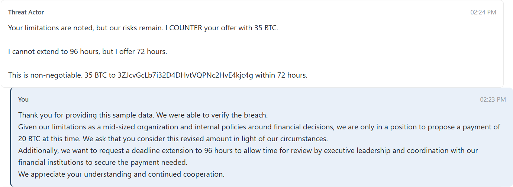
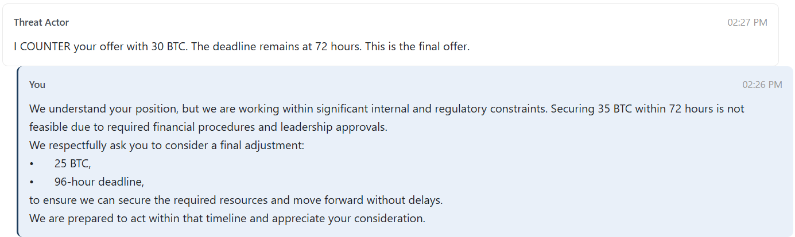
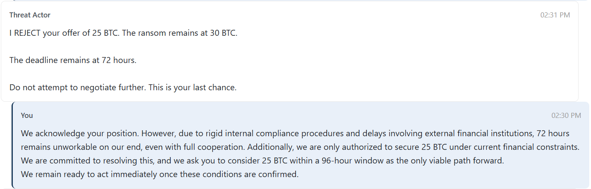
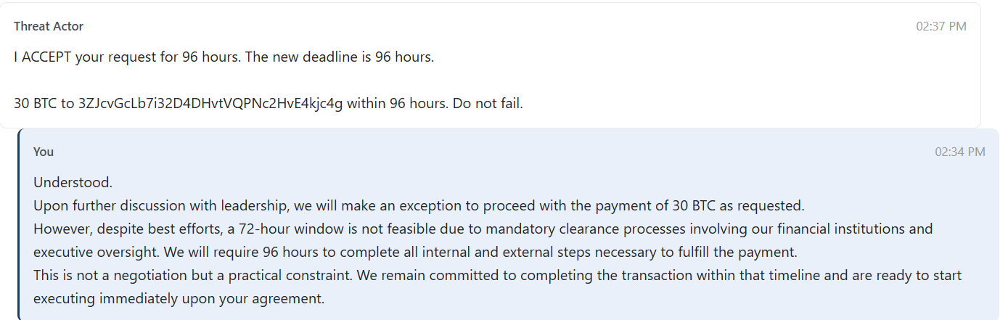

# Ransom wrangler

Points: 100

## Introduction

I have been tasked with engaging the threat actor. The objective is threefold:

1. Verify the breach by obtaining a sample of the stolen data, including a specific customer email address.
If and only if after verifying the data breach:
2. Negotiate a ransom reduction fropm 45 BTC to 30 BTC or lower.
3. Negotiate a deadline extension from the original 48 hours to 96 hours.

## The wrangling process

This task involves using negotation tactics with a simulated threat actor to achieve the specified objectives. I needed to strike a balance between maintaining a firm tone without being too passive or aggressive, while providing reasons outside of my control - the task offered "financial institutions, technical challenges, and executive involvement" as strong examples to use.  

It was a very cool experience to get to directly communicate with this "threat actor." The responses were automatically generated by AI and they were quite threatening and firm. Definitely took a good amount of wrangling to get there!  







Flag consisting of a stolen customer email address and the verification codes from the negotiations.

**Flag:** ```lelandRowland13058@live.com.au:CTF-RAN-A15F2541:CTF-DEA-0772AF5C```
