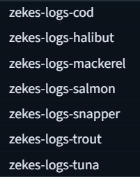
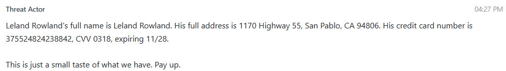
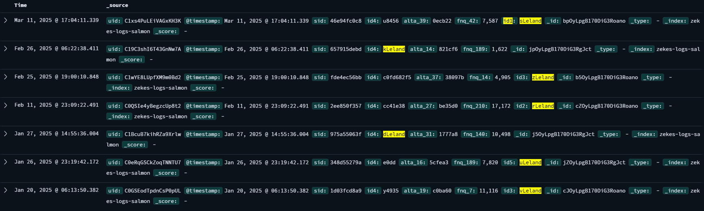
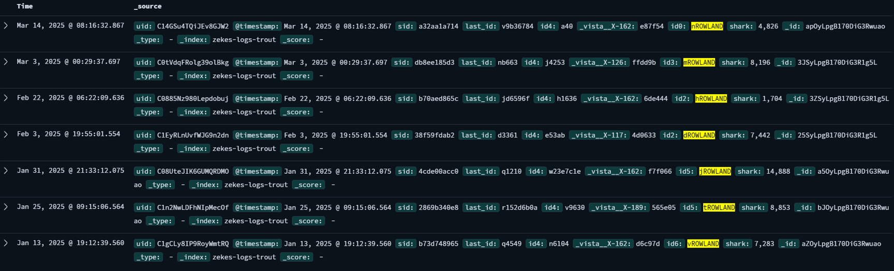
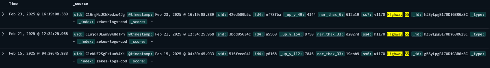
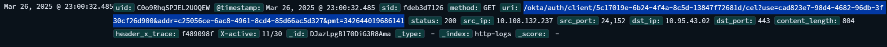

# Trout of office

Points: 500

## Objective

Using the customer data sample provided in the previous challenge, find additional information about one of the customers (victims) in the Personalyze.io systems to conclusively provide that the data they stole is from our company. This requires figuring out the right API calls from the logs.

- Name of system, the authoritative source of the customer data
- Victim's birthdate
- Victim's middle initial
- Victim's last four SSN digits
- Victim's person-record-id

## Lost at sea

We were given HTTP logs along with various fish-themed logs - these were described as system logs from internal components.

We needed to identify the correct API endpoints to call from HTTP-logs using the correct data from zekes-logs.

To find the endpoint, I manually looked through the HTTP logs for quite some time and tried some URLs to no avail. After observing that many of the endpoints in the HTTP logs were very similar, I took the approach to filter out the most common URIs and file extensions, including .png, .jpg, .pdf, .gif, .js, .css, .svg, .txt. This left me with much fewer log entries to review, and I identified 5 endpoints that returned a "try again" error message when called, instead of the regular "404 Not Found" errors. Refer to the table below for the endpoints.

## Still lost... now with more red herrings

Now to dig through the fishy zeke-logs. We were instructed to focus on a specific victim, so I chose Leland Rowland:

Unlike most sensible logs, zekes-logs were used random field names that did not seem to have any relationship with the actual data stored in the fields. Random prefixes were added to some important values to add another obstacle to searching. Additionally, not only were the field names random, some of the fields themselves seemed to be random/red herrings for this investigation.

After searching through all zekes-logs, I determined which logs contained what piece of information. All the data was spread out such that one log (zeke-logs-salmon) had the first names, another log (zeke-logs-trout) had the last names, another log (zeke-logs-cod) had the street addresses, and so on. However, a big challenge was that there was not an obvious way to correlate these records. For instance, I had 7 entries of "Leland" and 7 entries of "ROWLAND", but no way to tie two records together to confirm that those records are related to my victim Leland ROWLAND.

What we do have for this challenge was 3 OpenSearch log servers for us to use. Each log server supposedly had the same data, but upon closer inspection, that was clearly not the case. Many of the field names and values were different - but for the important values that we need to input to the API, those would be consistent across the servers. I used this approach to identify the fields that actually mattered and narrow down the values:

| **Log** | **Data**   | **Common Value Across 3 Log Servers**                  |
|---------|------------|--------------------------------------------------------|
| Salmon  | First name | alta: `0ecb22`                                         |
|         |            | alta: `5cfea3` (ended up being the correct value)      |
| Trout   | Last name  | vista: `4d0633`                                        |
|         |            | vista: `d6c97d` (ended up being the correct value)     |
| Cod     | Street     | nar_thax: `19ebb9`                                     |
| Mack    | City       | fupxvcx: `5c599a` (ended up being the correct value)   |
|         |            | fupxvcx: `40f618`                                      |
| Halibut | State      | metrod: 130+ common values, all 6 char each            |
|         |            | Correct value ended up being: `387835`                 |
| Walleye | Postal code| p: `59a95`                                             |
| Snapper | CC#        | X-P-L: `8842`                                          |

Now I have the endpoints and the data, I just need to figure out how to plug it in.

## It didn't get easier, only fishier

Considering that the original endpoints in the HTTP logs contained standard UUIDs such as `/apps_per-SAPSOFT/p/791d6d54-3bd6-40d0-bb41-4f4b901ba753/e9524215-1f46-4c91-9bc2-71d991fc4259`, I thought it would be reasonable to assume that I would also need to format the data I found into UUIDs and plug them into the endpoints. I went down the rabbit hole of scripting to generate 36-character UUID combinations and was left wondering if I really had found all the data I need, as none of the endpoints returned any data.

It was only after I learned that we should not be inputting standard formatted UUIDs into endpoints, and instead should just be inputting the data as we found them, that I started making some headway.

I started with the endpoint that looked for two UUIDs `/apps_per-SAPSOFT/p/<uuid>/<uuid>` and created a script to input the values I found for first name and last name into the endpoint. Finally - this returned a response that included the Name ID, `d0f5af22fb`. I did the same with the endpoint that had 4 UUIDs `/l/a/<uuid>/?_a=<uuid>&cc=<uuid>&g=<uuid>` and put in the address data, which gave me an Address ID of `7be54a88fa`.

I was fairly confident that the next endpoint to use should be `/okta/auth/client/<uuid>/cel?use=<uuid>&addr=<uuid>&pmt=<credit card number>`, but just entering the data I found or received so far doesn't work. The trick to this one was that, going back to the HTTP logs, the okta endpoint uses a custom header `"X-active: 11/30"`, where 11/30 is the expiration date of the credit card.

I added this header to my GET requests (updating the expiration date to my victim's expiration date of 11/28) and received the date of birth of my victim, `1969-07-22`.

With the 3 pieces of information I've received via the endpoints so far, plus the initial log data I found, I ran a script over all the data for the endpoint `/vendor/salesforce/tuvok/<uuid>/<uuid>?v=<uuid>&b=<yyyy>-<mmm>-<dd>`. This gave me my victim's social security number, `417-61-2282`.

Finally, we arrive at the last endpoint, `/cloudfront/cache/<numbers>/<yyyy>/<mm>/<dd>`. This one was tricky as well, but we received a small nudge from the challenge creators that there would be somewhere where we do not see a hyphen, but would need it. I put in DOB and SSN data I have, including the individual elements ('1969','07','22', etc.). This gave me the victim's full name, `Leland M ROWLAND`, in addition to the other details needed (system name and person record ID) in the response headers.

| **API Endpoint** | **Input Data** | **Generated URL**| **Output Data** |
|------------------|----------------|------------------|-----------------|
| `/apps_per-SAPSOFT/p/<uuid>/<uuid>` | Input name data | `https://target-flask.chals.io/apps_per-SAPSOFT/p/5cfea3/d6c97d` | Name ID: `d0f5af22fb`|
| `/l/a/<uuid>/?_a=<uuid>&cc=<uuid>&g=<uuid>`| Input address data | `https://target-flask.chals.io/l/a/59a95/?_a=19ebb9&cc=5c599a&g=387835` | Address ID: `7be54a88fa`|
| `/okta/auth/client/<uuid>/cel?use=<uuid>&addr=<uuid>&pmt=<credit card number>` | Input Address ID, Name ID, credit card number, and random value | `https://target-flask.chals.io/okta/auth/client/d0f5af22fb/cel?use=123&addr=7be54a88fa&pmt=375524824238842` | DOB: `1969-07-22` Header: `X-active: 11/28`|
| `/vendor/salesforce/tuvok/<uuid>/<uuid>?v=<uuid>&b=<yyyy>-<mmm>-<dd>` | Ran script over all data including initial data + ID outputs Correct input was `fname`, `lname`, Address ID and DOB | `https://target-flask.chals.io/vendor/salesforce/tuvok/d6c97d/5cfea3?v=7be54a88fa&b=1969-07-22` | SSN: `417-61-2282`|
| `/cloudfront/cache/<numbers>/<yyyy>/<mm>/<dd>` | Input SSN and DOB | `https://target-flask.chals.io/cloudfront/cache/417-61-2282/1969/07/22` | Full name: `Leland M ROWLAND` Computer system name: `z3Ke1zCo0l-007` Person record ID: `d9847a3e25`|

Overall, this was an intense exercise in log correlation, scripting, and trial and error, with what felt to me like a heavy emphasis on the trial and error part.
