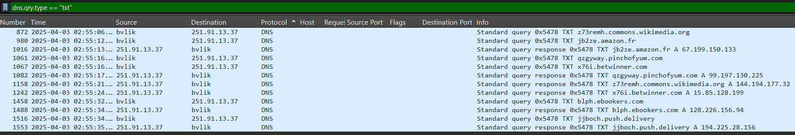

# Ahoy, PCAP'n

Points: 300

## Objective

Packet captures (PCAPs) of company network traffic are available, but only for a small window of time. Search through the PCAPs to find the name of our compromised machine and the command-and-control (C2) IP address of the threat actor, where the data is being sent to.

## Never gonna give you up

I opened the PCAP in Wireshark and started by searching for the known IPs from the previous challenges, no result. Next, I dug around for common ports and protocols that may be used for data exfiltration or establishing a C2 channel (e.g., FTP, HTTP/S, port 20, 21, 22, 23, 80, 443). I examined the HTTP POSTs, focusing on outbound connections to public IP address ranges. Knowing that the customer data contained email addresses and credit card numbers, I also tried to search for corresponding Regex patterns within the packet bytes. I took a look at some I/O graphs as well for unusual traffic patterns.

None of these attempts yielded anything particularly suspicious (other than gzipped HTML content that included some fun Rickrolling).

## Every day I'm tunneling

It was time to take a different approach. I researched other suspicious indicators or methods for data exfiltration, and that's when I learned about DNS tunneling, where DNS requests/responses are used as a covert communication channel to bypass security measures. In particular, TXT records are commonly exploited as they can carry larger payloads in the form of free-form text.

I did a search for `dns.qry.type == "TXT"` and indeed, a number of matches came up:

All of these exchanges took place between the same two IPs, one internal (`10.75.34.13` which resolves to `bvlik`) and one external (`251.91.13.37`). In the queries, there is something odd about the FQDNs. While the domain names are recognizable names, these subdomains are not common subdomains or even human-readable text - for example, *jb2ze*.amazon.fr and *qzgyway*.pinchofyum.com. These suspicious subdomains are almost certainly encoded. This is a typical technique used in DNS tunneling to encode stolen data into DNS packets, which then get sent to a malicious DNS server and decoded by the threat actor to retrieve the data.
