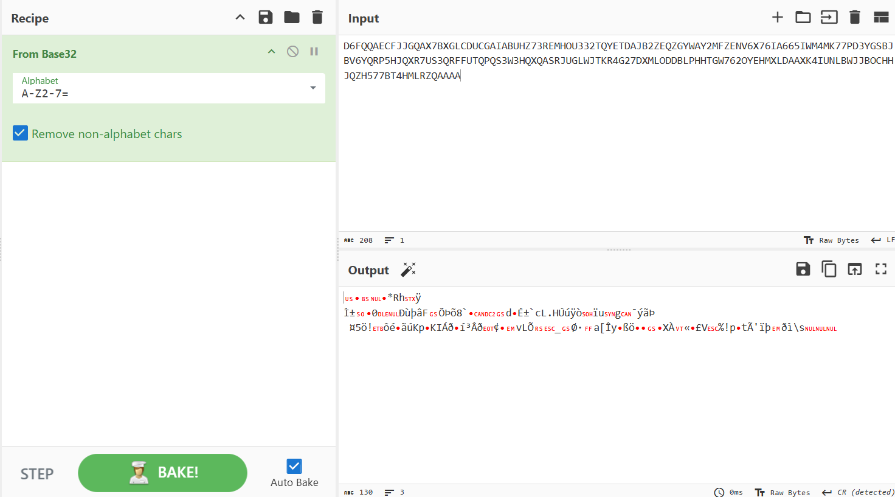
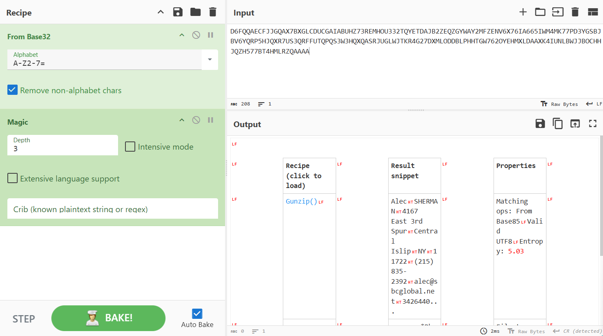

# Smuggled away

Points: 500

## Objective

Determine the credit card expiration date and CVV and the customer email being exfiltrated in the PCAP provided in the previous challenge.

## Preparation

Continuing from the last challenge, I searched for `dns and ip.addr == 251.91.13.37` in Wireshark and exported the output as CSV for analysis.
Within the CSV, I extracted the domains, split by ".", and only kept the subdomains. I filtered on the Source/Destination IPs to only focus on compromised host (`bvlik`) to C2 (`251.91.13.37`) communications. Finally, I consolidated all subdomains into a single string:

```
d6fqqaecfjjgqax7bxglcducgaiabuhz73remhou332tqyetdajb2zeqzgyway2mfzenv6x76ia665iwm4mk77pd3ygsbjbv6yqrp5hjqxr7us3qrffutqpqs3w3hqxqasrjuglwjtkr4g27dxmloddblphhtgw762oyehmxldaaxk4iunlbwjjbochhjqzh577bt4hmlrzqaaaa
```

## Decoding

I used [decode.fr](./https://www.dcode.fr/en)'s cipher identifier tool and tried using the top 5-6 suggested encoding schemes, as well as [CyberChef](./https://gchq.github.io/CyberChef/)'s magic functionality, but didn't get anything close to human-readable text.

After a healthy dose of struggling, I went back to the basics to research and better understand the binary-to-text encoding formats, how they work, and the differences between them - especially the most common ones like base32 and base64. I learned about padding, which is the addition of extra characters, usually equal signs, to the end of encoded data to ensure an appropriate length.

Then, I noticed that our encoded string ends in `aaaa`. Base32 encoding uses 1-6 characters of padding, whereas Base64 encoding uses 1-2 characters, while some other encoding schemes does not use padding at all. Additionally, the encoded string contains a to z letters in the same case + some numbers, which align with the characters used in base32 as well.

It's starting to look like base32 is the most likely encoding scheme used. However, base32 uses uppercase letters A-Z, while this string has all lowercase letters. So, the next step I took is to convert the lowercase letters to uppercase:

```
D6FQQAECFJJGQAX7BXGLCDUCGAIABUHZ73REMHOU332TQYETDAJB2ZEQZGYWAY2MFZENV6X76IA665IWM4MK77PD3YGSBJBV6YQRP5HJQXR7US3QRFFUTQPQS3W3HQXQASRJUGLWJTKR4G27DXMLODDBLPHHTGW762OYEHMXLDAAXK4IUNLBWJJBOCHHJQZH577BT4HMLRZQAAAA
```

I plugged this in to CyberChef. It wasn't quite there yet, but this time I'm sure I'm on the right track with using the appropriate encoding scheme.



Next, I added the Magic operation to the recipe. Voila! The second step was Gunzip. Gzip is a format for data compression and decompression.



This provided the final decoded output:

``Alec	SHERMAN	4167 East 3rd Spur	Central Islip	NY	11722	(215) 835-2392	alec@sbcglobal.net	342644019686141	0016	11/30``

**Flag:** ```11/30_0016_alec@sbcglobal.net```
