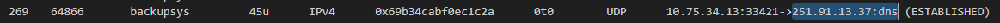
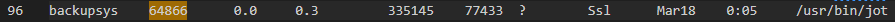

# Endpoints and exfiltration

Points: 100

## Objective

The compromised host has been identified as a backup server that stores highly sensitive data, and there are endpoint agents installed on the server. The data files given contain the outputs of shell commands run directly on the endpoint. The threat actor used a method to try to conceal the software being used.

Examine the outputs of the commands "lsof", "ps", and "history" in order to identify the OS process, user, and software that is performing the exfiltration.

## Task / Step

I first wanted to get a general understanding of what these commands/outputs are.

- lsof (LiSt Open Files): shows open files and processes accessing them
- ps (Process Status): displays information related to the processes running in a Linux system
- history: tool that displays a list of commands used in the terminal session

Recalling that the C2 IP address obtained in a previous challenge is `251.91.13.37`, I searched for this IP and found it in the `lsof` output:

This gave me the process ID `64866` and the username `backupsys`.

I searched for this process ID in the ```ps``` output:


Here I saw that the command line that launched this process is `/usr/bin/jot`. So I searched for this command within the `bash-history` output:

```bash
git clone git@github.com/elesiuta/backupy.git
pip install ./backupy
sudo rm /usr/bin/jot
ln -s /usr/bin/jot /usr/.local/bin/backupy
/usr/bin/jot
```
The series of commands above cloned a Git repo called backupy.git into a local folder named backupy, installed the Python package, removed the system binary `/usr/bin/jot` and created a symbolic link (i.e., shortcut) from `/usr/bin/jot` to `/usr/.local/bin/backupy`. This file path then gets executed. The malicious executable is `backupy`.

The flag consists of the username on the backup server running the exfiltration process, the name of the executable file that created the exfiltration process, and the process ID of that exfiltration process.

**Flag:** ```backupsys_backupy_64866```
