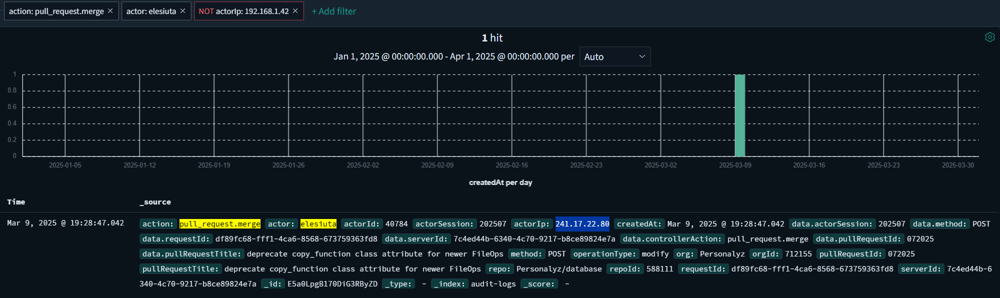

# Logging for truth

Points: 300

## Objective

From the GitHub audit logs, find the IP address that made the malicious commit from the previous challenge.

## Logs!

I searched for the actions performed by Erik (`actor: elesiuta`), and his normal IP address appears to be `192.168.1.42`.

So, I searched to see if any actions were taken by this user under a different IP address, and indeed I found the attacker IP `241.17.22.80` with a pull request title matching what I found in the previous challenge.

