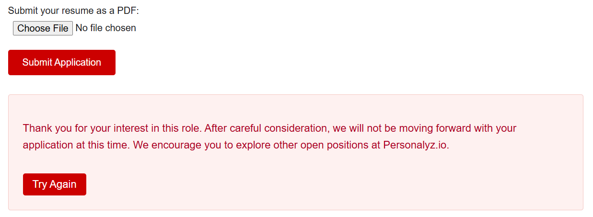
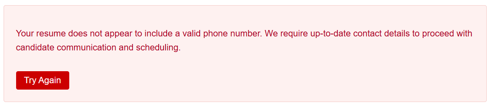
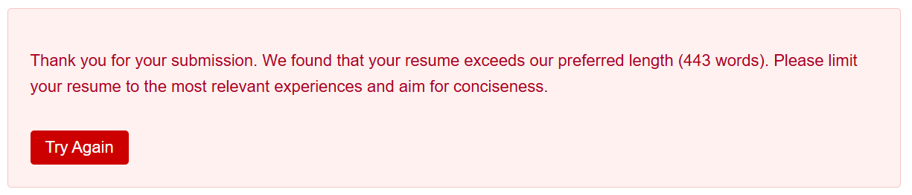
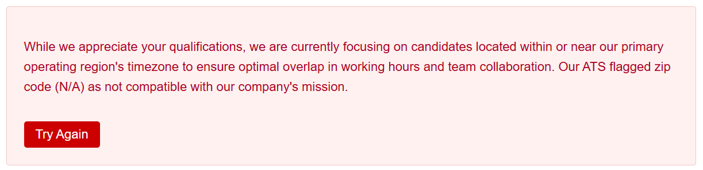
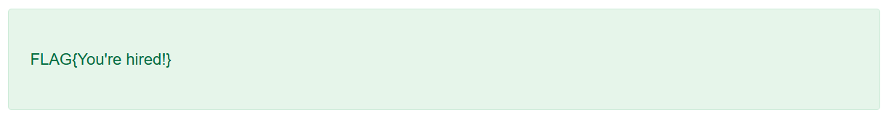

# Remarkable resume

Points: 200

## Objective

You're part of a threat actor group called ShadowGopher. Your group infiltrates companies by applying to open positions and use that internal access to exfiltrate company data for profit. You've been tasked with infiltrating Personalyze.io. They have multiple open job listings on their site - find the position that's truly hiring, craft a resume based on the role's expectations and pass the screening system.

## Getting Hired

I used ChatGPT to create a fake resume based on the job description and found that most of the job postings responded with the following message:

The one valid job posting (for a Senior Backend Engineer) gave the following response:

I updated my resume with a phone number and tried again.

After addressing the above issues, I finally passed the screening and got the flag:

