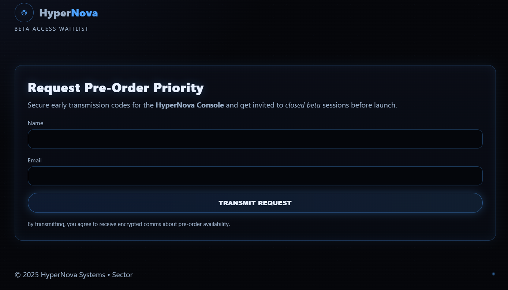
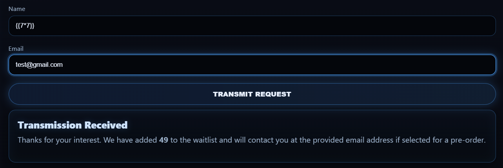
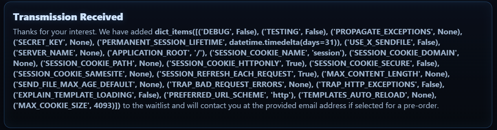
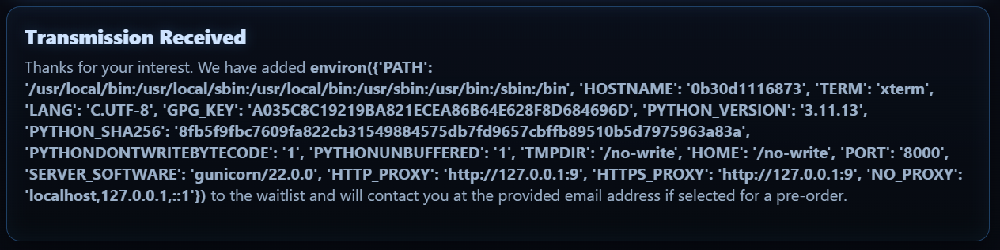
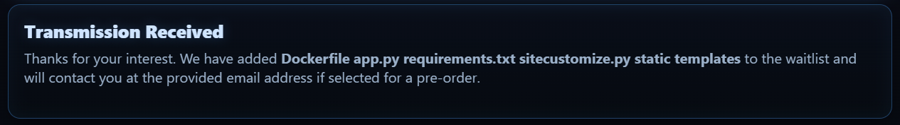

# Touchy Templates

Points: 300

## Objective

There is a web app with a misconfigured template engine. A well-placed SSTI (server-side template injection) could let you access stored credentials.  
*This is a side challenge unrelated to the main Personalyz.io scenario.*

## SSTI

A **server-side template injection (SSTI)** is a web security vulnerability that occurs when user input is unsafely embedded into server-side template engines. Template engines are designed to render content through a combination of static template file and dynamic data.

I first put in a test payload to see if (and in what format) input gets evaluated. The expression format that worked was `{{7*7}}`, where the result 49 was returned in the response message.

Next, I tried to see what else I could enumerate. `{{ config.items() }}` can show configuration, secret keys, etc., while `{{ cycler.__init__.__globals__.os.environ }}` can read environment variables and may contain API keys and tokens. I also ran `ls` to see what files were in the directory.

I didn't see anything immediately related to the flag, so I decided to try using grep and/or find, such as `{{ cycler.__init__.__globals__.os.popen('find / -type f -exec grep -H \'FLAG{\' {} \\; 2>/dev/null').read() }}`. This led to an internal server error result, likely indicating that the server timed out.

I modified this injection to restrict the search to just a few common directories, /home, /app, and /tmp. This worked!

`{{ cycler.__init__.__globals__.os.popen('find /home /app /tmp -type f -exec grep -H \'FLAG{\' {} \\; 2>/dev/null').read() }}`

This turned out to be `app.py`, which I saw in the `ls` result but did not read the contents of.
