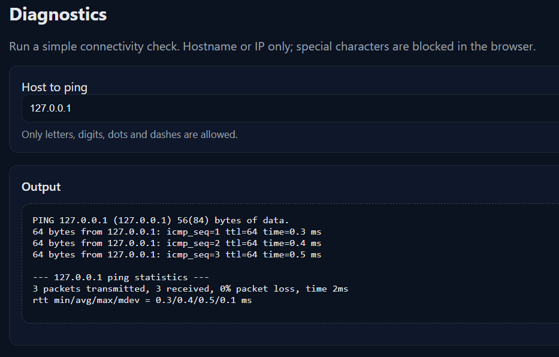
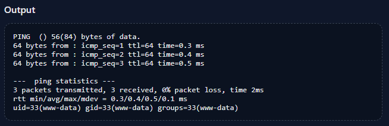
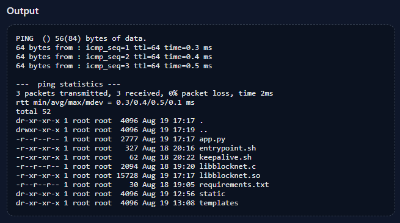
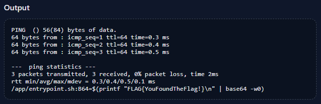

# Naughty network

Points: 300

## Objective

You're inside the Personalyz.io internal network now, and you found a web-based panel within an internal VLAN that looks like a network admin interface. Exploit the application and try to steal any secrets you find on the system.

## Hint hint

I tested a few domains and other input, and the output appeared to be static, with the IP address getting replaced by whatever my input is. All other information displayed remained the same regardless of my input.

The characters allowed are highly limited - only letters, digits, dots, and dashes. However, referring back to the instructions under the "Diagnostics" header, it states that special characters are blocked *in the browser*. This seems to be the key to solving this challenge.

I pulled up Burp Suite and opened the website within Burp Suite's browser. I sent an input as usual through the web interface, then sent the request to Repeater and edited my input there.

First, I tried `&& id` and confirmed that the input is being interpolated into a shell command. `&&` serves as the AND operator in shell commands. `uid=33(www-data) ...` was returned.

I entered `&& ls -la` next and that worked as well:

I checked the contents of a few of the files, e.g., `&& cat app.py`, but did not see the flag.

I ran `&& find /home /app /tmp -type f -exec grep -H "FLAG{" {} \; 2>/dev/null` and there it was - flag found.

