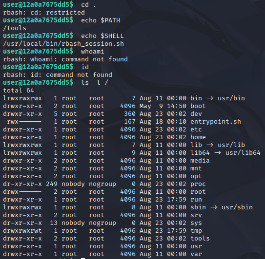
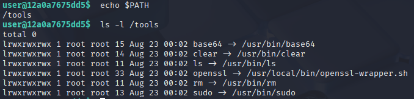
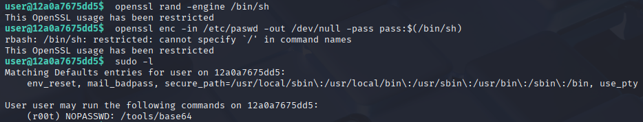
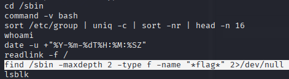
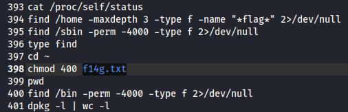
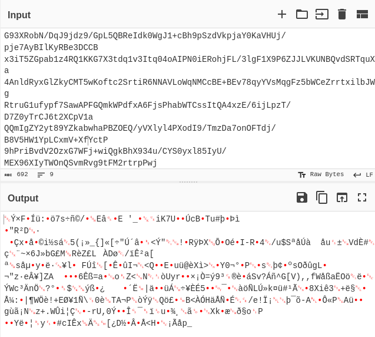
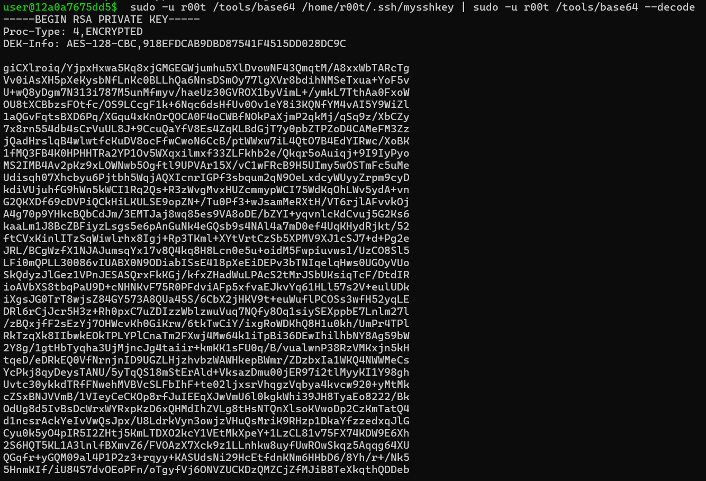

# Escalation of power

Points: 300

## Objective

You have the company-issued laptop in hand. SSH into the system with the limited access you have, enumerate the machine and look for a vulnerability or misconfiguration, and exploit it to escalate your privileges and obtain the flag.

## Checking my privileges

We were provided the connection instruction `ssh user@0.cloud.chals.io -p 20009` with a user password of `XrW/YgVyqho08+Gv`.

After making the SSH connection and authenticating, I got access to a **restricted bash** (rbash), a special mode of the Bash shell that restricts the user's ability to perform certain actions. Through my testing, I identified the following restrictions:

- cd is blocked
- `/` is forbidden in command names
- `PATH` is read-only
- Cannot redirect output
- Globbing (wildcard) not allowed

So, instead of changing directories, I will have to enumerate via `ls` instead. I took a look at `/usr/bin` to see if there was anything I could use, specifically looking for "s" in the execute position of permissions, indicating that when the file is executed, it runs with the effective user ID of the file's owner (often root) regardless of who is executing it. This is commonly used for programs like passwd that need temporary root privileges.

After some exploration and testing, I realized that due to the PATH read-only restriction, I can only invoke what is in the path `/tools`.

Since openssl is one of the tools available, I tried using openssl to spawn a shell, but such usage is also restricted in this rbash. However, `sudo -l`, which shows the commands you are allowed to run with sudo on the current host, revealed that **base64** can be run without a password. While I can't spawn a shell this way, what I can do by running base64 as `r00t` is reading any file on the system that this user `r00t` has access to. Also note that `r00t` is not the same as "root", it is a custom user.

## Escalating

I confirmed that running base64 as the r00t user did allow me to read `/etc/passwd`, for example. Note that there is a limitation here - with base64, I need to know (using `ls` as a regular user) or guess the path and filename. Unfortunately, my user does not have access to r00t's home directory `/home/r00t`, so I have to do some brute forcing here.

I found r00t's bash history, which included many commands attempting to "find" the flag.

There was also a particularly interesting line that mentioned a `f14g.txt` file:

I went to read this file using `sudo -u r00t /tools/base64 /home/r00t/f14g.txt | sudo -u r00t /tools/base64 --decode` - the output was non-intelligible.

I tried decoding in CyberChef, unzipping, etc. but did not have any luck. It seemed likely that I was missing something important to the decoding process here.

I continued digging in the `/home/r00t/` directory to see what else I could find. I came across an SSH key:

This is the private SSH key which is encrypted with a password. I copied the contents of `mysshkey` and `f14g.txt` to my local machine for easier analysis. I tried connecting to `ssh -i mysshkey r00t@0.cloud.chals.io -p 20009` using the private key file and was prompted for a password. The only password I had was the password of "user" that was provided to us, and sure enough, this was accepted as the private key password. However, I was still prompted to enter a passphrase for r00t. Seems like directly connecting to r00t is not the right approach.

I was also able to double check that this is the correct password for the private key by running `ssh-keygen -y -f mysshkey`, using the password, and confirming that it matches the public key `mysshkey.pub` which could also be found under `/home/r00t/.ssh/mysshkey.pub`.

At this point I was a bit lost as to how to proceed with the information I have. I did some more research and learned about **hybrid encryption**, in which the first block of the file is typically the *RSA-encrypted AES key*, while the remainder of the file is the *AES-encrypted data*. This approach of using an asymmetric algorithm to encrypt a symmetric key is commonly used in TLS, PGP, etc.

The decryption process involves using RSA private key to recover the AES session key, then using that AES key to decrypt the data.

First, I decrypted `mysshkey` with the passphrase `XrW/YgVyqho08+Gv`.

`openssl rsa -in mysshkey -out mysshkey_decrypted`

Next, I determined the private key bit size to be 4096 bits or 512 bytes.

`openssl rsa -in mysshkey_decrypted.pem -text -noout | grep "Private-Key"`

Next, I ran a Python script which took the first 512 bytes and decrypted it using the now decrypted RSA private key `mysshkey_decrypted.pem`. This gave me the AES key `666c61677b7375646f5f6d3464655f6d335f723030747d0a`. 

When I tried to proceed with using this key to decrypt the rest of the data, I found that this was not a standard key size (128, 192, 256 bits). This key size is 40 hex digits (=160 bits or 20 bytes). This key can actually be converted from hex to ASCII to get the flag: `flag{sudo_m4de_m3_r00t}`
