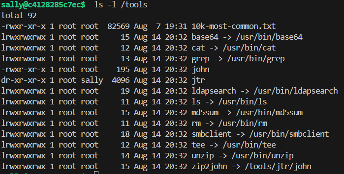
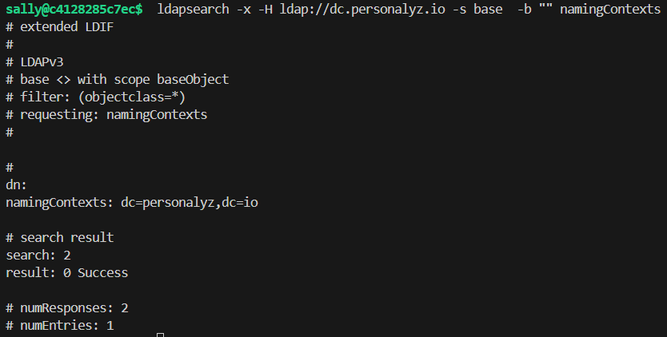
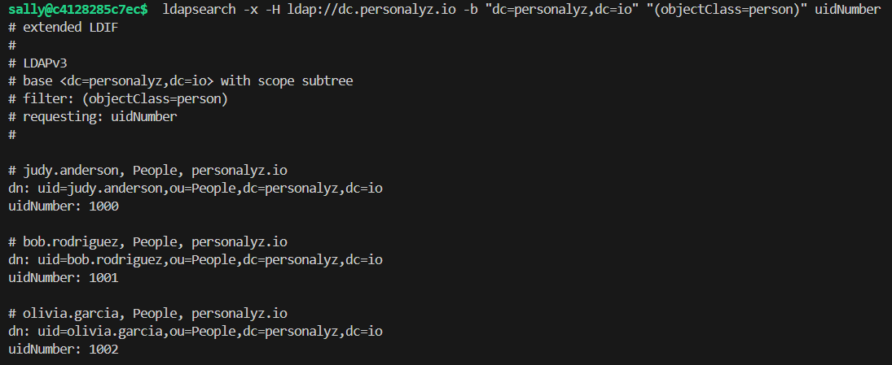
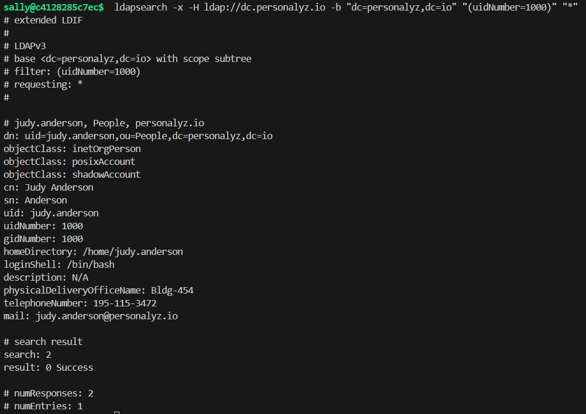
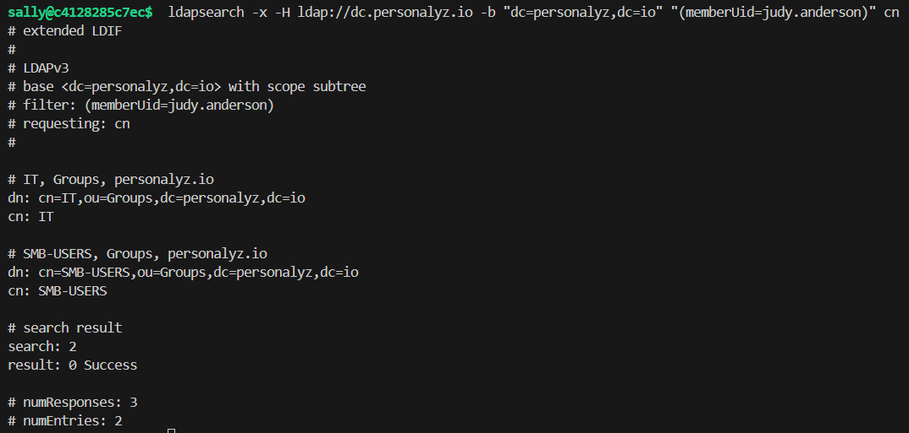
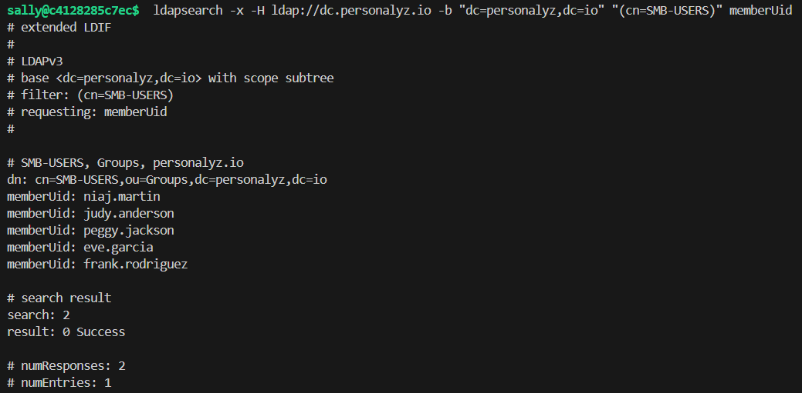

# Permission pathways

Points: 200

## Objective

You have read-only access to the directory at `dc.personalyz.io`. No authentication required. Use the tools in `/tools` and enumerate the directory structure, identify the organization users, trace their group membership and submit the uidNumbers of all the accounts within a special group.

## LDAP

I connected via SSH and enumerated the tools available to use:

ldapsearch is a tool used to query and search LDAP.

I started by finding/confirming the base distinguished name (DN) to use, which is the starting point in the LDAP directory tree.

Based on this, I started enumerating for users in the organization:

This returned a lot of people, but we need information about their group membership. I tried a couple searches, such as `ldapsearch -x -H ldap://dc.personalyz.io -b "dc=personalyz,dc=io" "(objectClass=person)" dn memberOf`, but nothing turned up.

I decided to take a look at all attributes for one person, and in the result there is a "gidNumber." This method helped me determine that there are several groups: 1000 - 1004, corresponding to different organizational groups within the company such as IT and Legal. However, none of these groups were the "special" group I need to find.

I tried a different command to enumerate all the groups that one person was a part of, and this revealed another group, **SMB-USERs**.

I checked the members of the SMB-USERs group, queried each member for their uidNumber, and submitted them as the flag.

