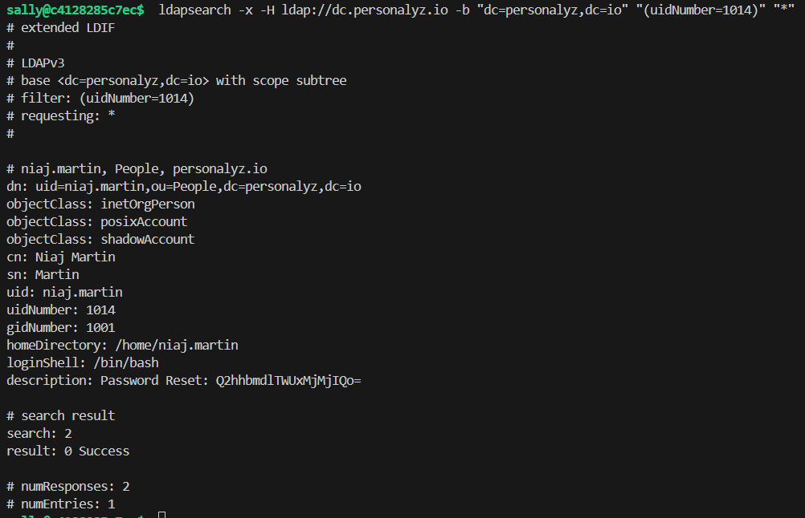
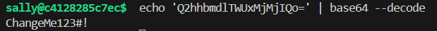

# Permission pathways

Points: 200

## Objective

These special accounts can access a SMB fileshare. Find the password for one of these users among the LDAP data.

## Password

While looking at the user attributes during the last challenge, I came across a particular user, Niaj Martin, who had a "description" field containing "Password Reset: Q2hhbmdlTWUxMjMjIQo=".

I tried submitting this as the answer but it was not correct. Upon closer look, this is just Base64 encoded! Decoding it gives us the flag.

