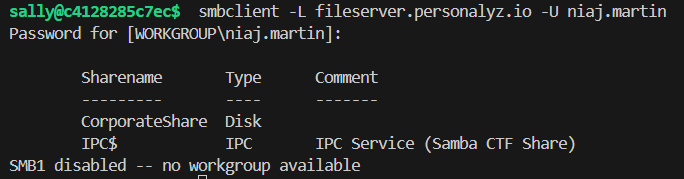
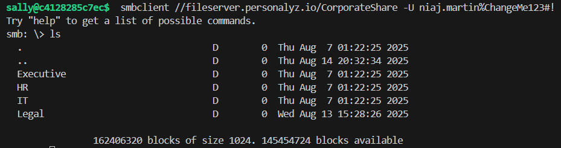
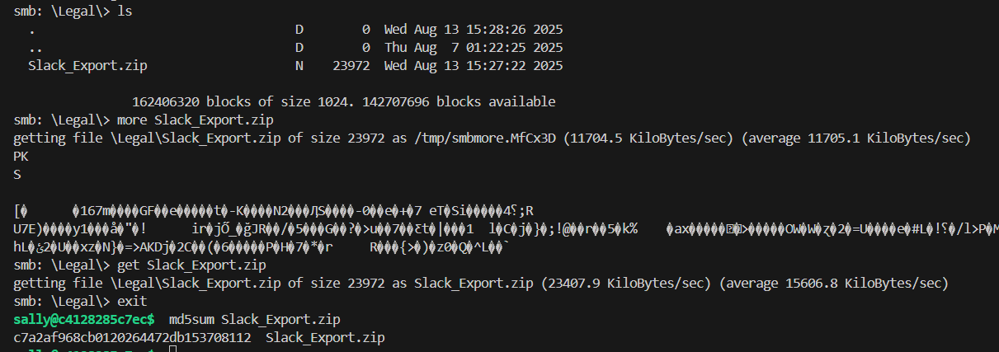

# Permission pathways

Points: 200

## Objective

Explore `fileserver.personalyz.io` using the tool smbclient, enumerate the contents and look for a file containing interesting information. Download that file and compute the MD5 hash of that file.

## SMB

We were given the server name but not the share name. I ran a command to identify valid share names:

Inter-Process Communication (IPC) is a special administrative share, not used for storing files. So the share name is "CorporateShare."

Using the password found in the last challenge, I connected to the share and dug around the directory:

A couple files stood out to me, including a rotatecreds.ps1 file, as well as a Slack_Export.zip file. I tried both and it turned out to be the Slack_Export.zip, which is password-protected:

