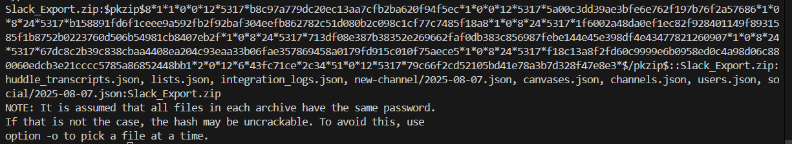
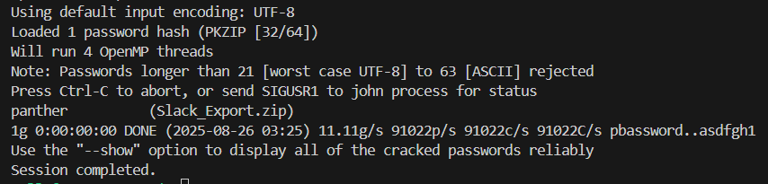
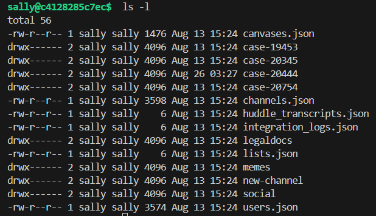

# Permission pathways

Points: 200

## Objective

Using the tools in `/tools`, extract the password hash to the archive found in the previous challenge, crack it, and use the password to unzip the Slack archive. Use the wordlist located at `/tools/10k-most-common.txt`.

## Password cracking

One of the tools available is John the Ripper. I first use john to extract the password hash of the Slack zip, which is the part of the output between `$pkzip$ hash $/pkzip$`.

`zip2john Slack_Export.zip`

Because this rbash does not allow redirecting output / writing output to file via `>`, I ran john via process substitution:

`john --wordlist=/tools/10k-most-common.txt <(zip2john Slack_Export.zip)`

Password was found to be "panther." I used this to extract the Slack export:

