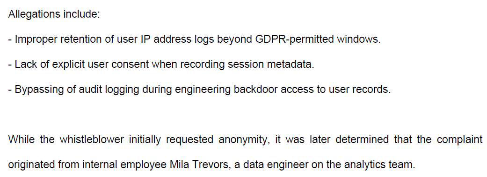

# Permission pathways

Points: 200

## Objective

An anonymous whistleblower came forward with internal evidence that pointed to serious legal and ethical failures inside the company. The allegations involve unauthorized surveillance, data retention violations, and improper access controls surrounding personal data from millions of users. Enumerate the decrypted Slack archive files and identify the name of the whistleblower.

## Investigation

The Slack archive contained several JSON files of Slack channel chat history between two employees. I used ChatGPT to summarize the conversations and I read the summaries to pinpoint which case/file is actually relevant to this challenge. Each conversation contained one or more PDF document.

`case-19453/2025-08-07.json`

This conversation and the included documentation was around the internal proceedings related to the termination of Brandon Sweeny, who violated internal policy and failed to comply with critical security protocols. This sounds like the same incident, but the documentation did not contain any details on who reported it.

`case-20754/2025-08-07.json`

This conversation involved sharing of a PDF report and instruction to keep it confidential. `CASE20754_Report.pdf` turned out to be the whistleblower report and named Mila Trevors as the whistleblower.

