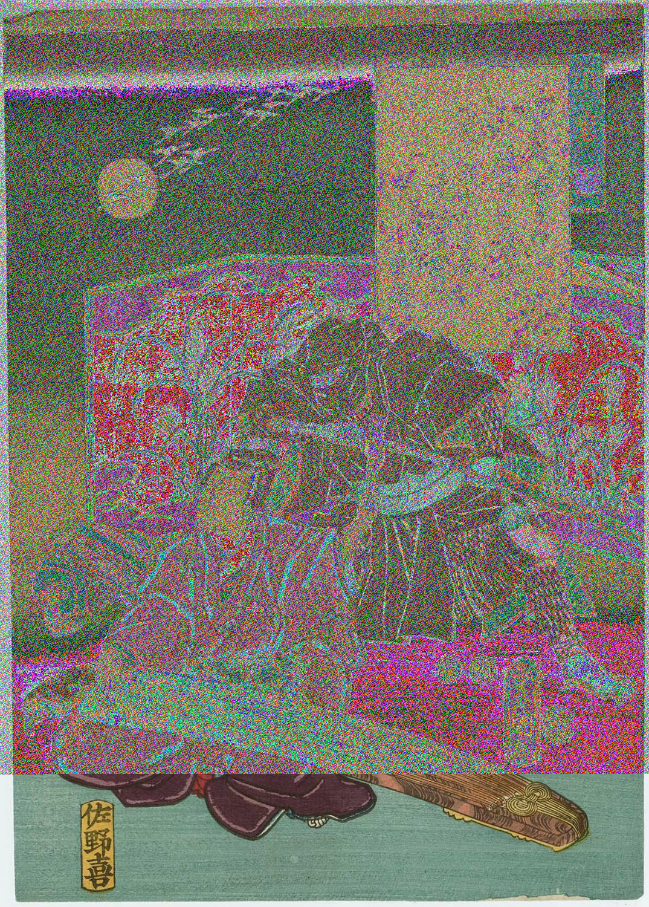
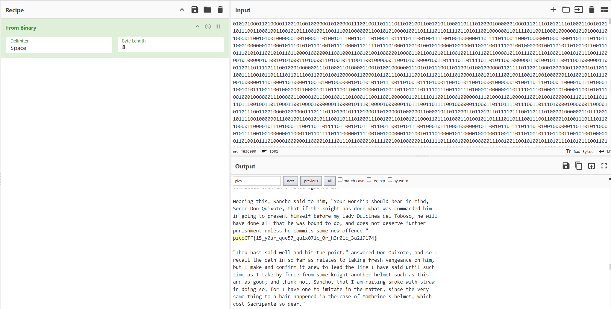

# MSB

Category: Forensics  
Difficulty: Medium

## Objective

This image passes LSB statistical analysis, but we can't help but think there must be something to the visual artifacts present in this image.

## Steps



Since this challenge is titled "MSB," I can reasonably assume that most significant bit (MSB) steganography is being used, similar to LSB steganography except the bits that carry the *most* weight in the binary representation are altered.

I used the following Python script to extract the most significant bit from each RGB color of each pixel, then combine the MSBs into a binary string and output for analysis. The Python imaging library enables image processing, manipulation, as well as pixel-level access.

```python
from PIL import Image

def extract_msb_binary(image_path, output_path="msb_output.txt"):
    img = Image.open(image_path)
    img = img.convert("RGB")
    width, height = img.size

    with open(output_path, "w") as f:
        for y in range(height):
            for x in range(width):
                r, g, b = img.getpixel((x, y))

                # Extract MSB by shifting the bits of r right by 7 positions, moving the MSB to position 0
                r_msb = (r >> 7)
                g_msb = (g >> 7)
                b_msb = (b >> 7)

                # Combine into a binary string
                binary_str = f"{r_msb}{g_msb}{b_msb}"
                f.write(binary_str)

extract_msb_binary("flag.png")
```

I used CyberChef to convert the output file from binary to ASCII and found the flag within the output text:


