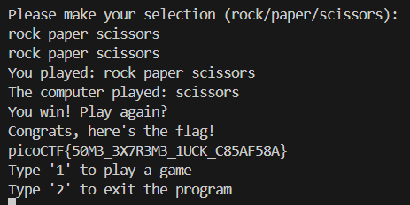

# RPS

Category: Binary Exploitation  
Difficulty: Medium

## Objective

Here's a program that plays rock, paper, scissors against you. I hear something good happens if you win 5 times in a row. The program's source code with the flag redacted is provided. Connect to the program with netcat.

## Steps

The challenge states that I need to win 5 times in a row. I reviewed the source code to see how the win condition is evaluated.

```C
if (strstr(player_turn, loses[computer_turn])) {
    puts("You win! Play again?");
    return true;
    }
```

`strstr(haystack, needle)` is a C function that returns a pointer to the first occurrence of the substring `needle` in the string `haystack`. This means that the win condition is checked as having the winning choice as a substring, so I can just enter "rock paper scissors" as my choice and win every time.


