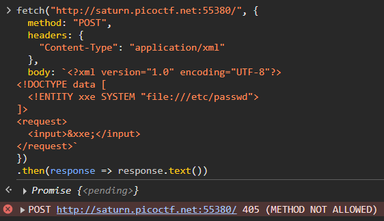
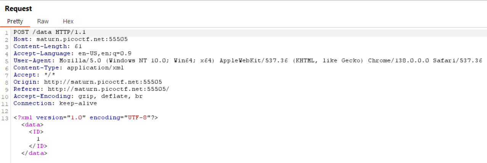
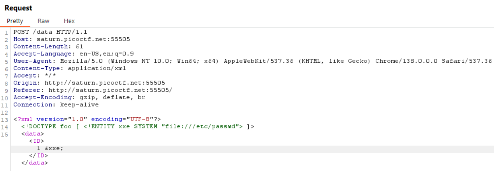

# SOAP

Category: Web Exploitation  
Difficulty: Medium

## Objective

The web project was rushed and no security assessment was done. Can you read the /etc/passwd file?

## Steps

This challenge provided the hint that this is a XML external entity injection (XXE), which is a web security vulnerability where XML input with a reference to an external entity is processed by a weakly configured XML parser, allowing for data exfiltration, server-side request forgery, and more.

I started off by examining the website using Chrome DevTools and found two JavaScript files in the Sources, `Details.Check.js` and `xmlDetailsCheckPayload.js`. The first JavaScript file adds an event listener to each "Details" button on the page, which triggers a function that uses Fetch API to send an XML payload that is defined in the second JavaScript file.

Within the DevTools console, I tried to send a Fetch request with XXE injection. The objective here is to retrieve a file (/etc/passwd), so I did some research and found that this can be achieved by adding a payload like `<!DOCTYPE foo [ <!ENTITY xxe SYSTEM "file:///etc/passwd"> ]>`. This defines a XML entity (`xxe`) that refers to a local file on the server `/etc/passwd`. This entity is injected into the XML body as `&xxe;`, e.g., `<data> &xxe; </data>` ([reference: PortSwigger](https://portswigger.net/web-security/xxe)).

However, I received a "method not allowed" error, indicating this server doesn't allow the POST method for this resource.

A tool like Burp Suite is needed to bypass this restriction by intercepting, modifying, and forwarding requests.

I opened the web portal within Burp Suite and clicked on one of the "Details" button (with the Intercept feature turned on). This sent the following POST request:

With this request intercepted, I added in the XXE injection payload like before and forwarded it to the server:

Now I checked the website again and saw that the content of `/etc/passwd` was returned, along with the flag.

