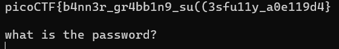

# dont-you-love-banners

Category: General Skills  
Difficulty: Medium

## Objective

Can you abuse the banner? The server has been leaking some crucial information on `tethys.picoctf.net 61620`. Use the leaked information to get to the server. To connect to the running application use `nc tethys.picoctf.net 59428`. From the above information abuse the machine and find the flag in the /root directory.

## Steps

I netcat to the server leaking information: `nc -v tethys.picoctf.net 61620` and found the server password: `My_Passw@rd_@1234`


Next, I netcat to the second server as directed `nc tethys.picoctf.net 59428` and answered the questions; the second question took a couple guesses.


This got me into the server shell. I dug through the directory and files, particularly the `/root` directory as instructed. This directory contains `script.py` which is the script that generates the banner and questions during the initial connection to this host, as well as `flag.txt` which I do not have permission to open.


In `script.py` above, we can see that the banner is supplied in `/home/player/banner`. So, we can change this to point to `/root/flag.txt` in order to display the flag.
This can be done using symbolic links (symlinks), which is a file that serves as a pointer to another file or directory.

I deleted the original banner file then created the symlink:


Now `nc tethys.picoctf.net 59428` shows the banner info containing the flag!



**Flag:** ```picoCTF{b4nn3r_gr4bb1n9_su((3sfu11y_a0e119d4}```
