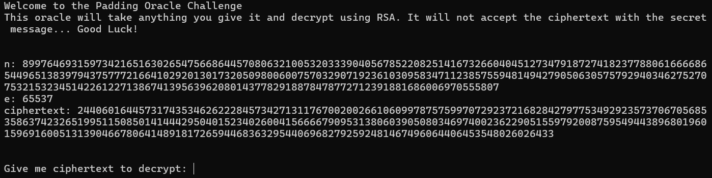

# No padding, no problem

Category: Cryptography  
Difficulty: Medium

## Objective

Oracles can be your best friend, they will decrypt anything, except the flag's ciphertext. How will you break it? Connect with `nc mercury.picoctf.net 10333`.

## Steps

I connected to the decryption oracle as instructed. It is stated that this oracle will decrypt using RSA, but it will not decrypt the flag ciphertext. Below that is the flag cipher text along with the modulus (n) and exponent (e).



We cannot directly decrypt the ciphertext, but we can input any other cipher text to get the corresponding plaintext. This is a **chosen plaintext attack**. Plain RSA (with no padding) is not secure against chosen plaintext attack due to its **multiplicative homomorphism** property, meaning that encrypting the product of two numbers == encrypting two numbers individual THEN multiplying the resulting ciphertexts together ([reference](https://arminstraub.com/downloads/teaching/cryptography-spring19/lecture32.pdf)).

First, I computed the ciphertext of the product of a chosen value, 2, multiplied by the flag ciphertext: `(2^e * c) mod n`

```python
x = 2
e = 65537
n = 89976469315973421651630265475668644570806321005320333904056785220825141673266040451273479187274182377880616666865449651383979437577721664102920130173205098006007570329071923610309583471123857559481494279050630575792940346275270753215323451422612271386741395639620801437782918878478772712391881686006970555807
c = 24406016445731743534626222845734271311767002002661060997875759970729237216828427977534929235737067056853586374232651995115085014144429504015234026004156666790953138060390508034697400236229051559792008759549443896801960159691600513139046678064148918172659446836329544069682792592481467496064406453548026026433
# s^e mod n
s_to_e_mod_n = pow(x, e, n)
# c' = (s^e * c) mod n
c_prime = (s_to_e_mod_n * c) % n
print(c_prime)
```

The resulting ciphertext is `42157812257464795010762404983294969283061819549094782356484845890486647675863756692903855220154908685816092480429292562260017744602928240808138316259696072122873642812367998127844873016370394331031126821380324264820278374361218356394087953971774787466905285381265808546401805837884401822775477394323900177257`

Next, I input the calculated ciphertext into the decryption oracle.


The resulting plaintext is `580550060391700078946913236734911770139931497702556153513487440893406629034802718534645538074938502890768853279675297196794`.

Dividing this plaintext by 2 gets us the flag plaintext `290275030195850039473456618367455885069965748851278076756743720446703314517401359267322769037469251445384426639837648598397`.

Finally, I used `Crypto.Util.number.long_to_bytes` which convert a positive integer to a byte string.

```python
from Crypto.Util.number import long_to_bytes
plaintext = 290275030195850039473456618367455885069965748851278076756743720446703314517401359267322769037469251445384426639837648598397
flag = long_to_bytes(plaintext)
print(flag)
```

The printed flag: `b'picoCTF{m4yb3_Th0se_m3s54g3s_4r3_difurrent_1772735}'`
