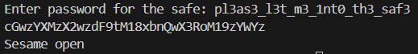

# Safe opener

Category: Reverse Engineering  
Difficulty: Medium

## Objective

Can you open this safe? I forgot the key to my safe but this program is supposed to help me with retrieving the lost key.

## Steps

I opened the Java file and examined the code, which shows that the user-supplied password gets base64 encoded and is checked against a hardcoded string, `cGwzYXMzX2wzdF9tM18xbnQwX3RoM19zYWYz`.

Performing base64 decoding on this string gives `pl3as3_l3t_m3_1nt0_th3_saf3`, which opens the safe and is also the flag for this challenge.

In order to enter the password for the safe, I compiled the Java file and ran it:

```
javac SafeOpener.java
java SafeOpener
```


