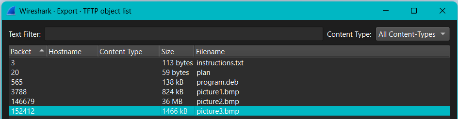
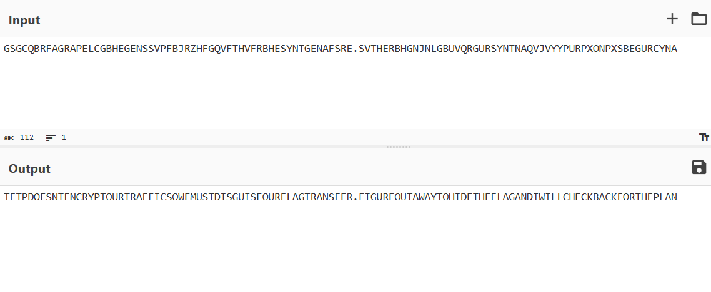
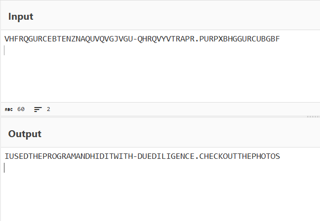
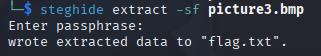

# Trivial Flag Transfer Protocol

Category: Forensics  
Difficulty: Medium

## Objective

Figure out how they moved the flag.

## Steps

The name of this challenge refers to Trivial FTP, a lightweight file transfer protocol. I opened the provided PCAP and checked the TFTP object list.

There are 5 objects lists. The first one, `instructions.txt`, contains ROT13 (rotate by 13) string that talks about TFTP not encrypting traffic and figuring out a way to hide the flag.

The next file, `plan`, similarly used ROT13 and said that the "program" was used to hide it with "due diligence."

Since .deb is a software package format used in Debian-based Linux distributions, I loaded it into a Kali Linux VM to inspect it. It contained steghide, which is a steganography program that hides data in various kinds of images and audio files. I had trouble installing program.deb, so I directly used the steghide tool to attempt to extract data from the three pictures. All of them required a passphrase. Earlier in the `plan` file, it mentioned that DUEDILIGENCE was used to hide the data. So, I tried entering this as a passphrase. No luck with picture 1 and 2, but this worked to extract picture 3 and retrieve the flag.

